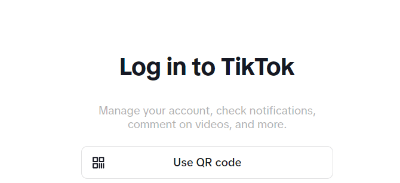
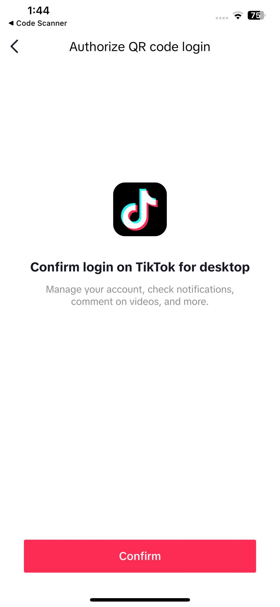
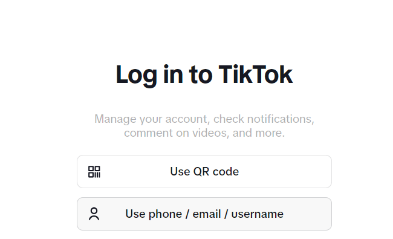

# Ethical Hacking Technical Report #
# Tiktok in Website 
Date: May 5, 2024

Prepared by: Hexaldin G. Saba and Rodelyn A. Sandrino

Was created by Zhang Yiming is the main founder of Chinese tech giant ByteDance, best known for its insanely popular app TikTok, which has more than 1 billion users worldwide.

## The app collects sensitive information from its users, and it is often taken without the user’s explicit knowledge such as:
* email addresses
* phone numbers 
* content you upload 
* and information about your keystroke patterns
* wireless connections, device brand and model, operating system
* Included in its data collection are contents of messages and times they are sent, received and read. 

# Vulnerability: #

Tiktok has possibility hack using the QR Code with Mobile phones that will scan to log in the account.

But the account owner will receive the permission first before login success. In that case, the account can still recovered even they can't allow other devices to access. 

This the sample of asking a permission in Mobile devices that windows or desktop wants to access the other account.

*- For me and my partner against with this security login, because the other people has the ability to take advantages other accounts try to hack and play with some bad things to the other friends of account owner. This raises red flags on two fronts: privacy and cybersecurity. The accumulation of data collected by the app is substantial and security experts contrast TikTok’s privacy policy with users’ expectations when on the app, expectations that leaves users vulnerable to cyber-attacks. Additionally, TikTok’s parent company is located in China. Based on the current tensions between some countries and China, there is scepticism about TikTok’s privacy policy. Various countries have expressed concerns that companies in China may be compelled to share data they have with Chinese government*

# No.2 Use phone/email/usrname

This is also can hack using the email, hacker can use the email of owner using the weak password or to forget the password if they don't have the "Two-Factor Authentication" it could be possible to hack the account.

*But tiktok has already Two-Factor Authentication when you have tiktok account to make sure that you have the privacy for your account, TikTok provides the option to log in with a verification code sent to your phone, but this is a one-time access code. Single-factor authentication is not uncommon on social platforms. Coupled with a weak password, this creates a possible security issue as it can lead to phishing or ransomware attacks, among other threats. Many social media platforms now offer two-factor authentication.*